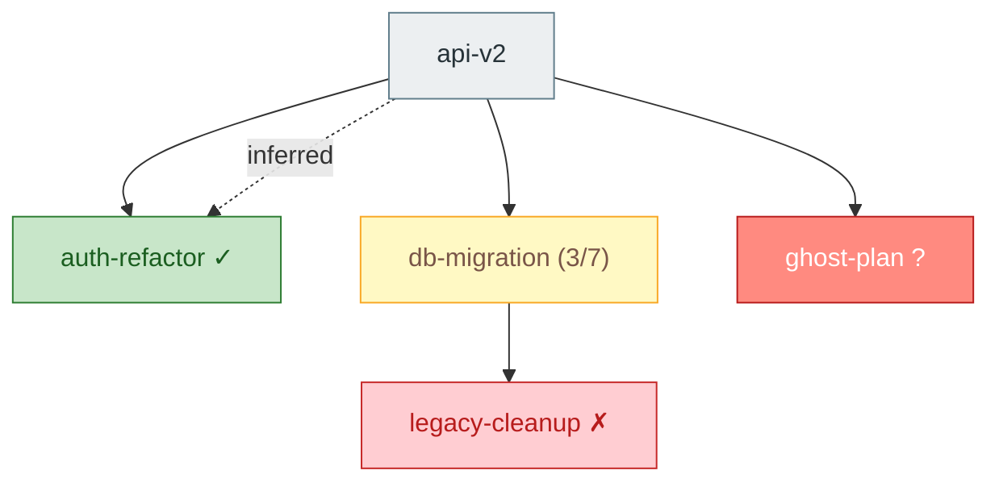

The user wants to build a dependency graph across plans. Follow these steps:

### Step 1: Collect all plans

Scan these directories for `.md` files:

- `.claude/plans/` — active plans
- `.claude/completed/` — completed plans
- `.claude/cancelled/` — cancelled plans

Exclude these meta files (they are indexes, not plans):
`COMPLETED.md`, `CANCELLED.md`, `DEPENDENCIES.md`

Each plan has a canonical name: the filename without `.md`.

### Step 2: Parse each plan

For every plan file, read the full content and extract three things:

**1. Explicit dependencies** — from YAML frontmatter:

```yaml
---
depends_on: [auth-refactor, db-migration]
---
```

`depends_on` may be a YAML list or a single string. Dependency values are plan names (filename without `.md`). These are authoritative.

**2. Inferred dependencies** — from prose. Scan each plan's body for references to other plans. A plan is a probable dependency if the body mentions another plan's name (filename or a clearly-derived title) in a blocking/sequencing context. Look for phrases like:

- "blocked on X", "blocks on X", "gated on X"
- "depends on X", "requires X", "needs X first"
- "after X ships", "once X lands", "when X is done"
- "deferred pending X", "waiting on X"
- Direct filename references like `charts-project-integration.md` or `[link](../plans/foo.md)`

Only infer a dependency when the mention clearly indicates sequencing. A passing mention ("similar to X") is not a dependency. When in doubt, include it but mark it inferred — the user can promote or ignore it.

Inferred deps must resolve to an actual plan name in the set collected in Step 1. If the prose names something that doesn't match any plan, skip it (don't emit missing-edges for prose guesses).

**3. Completion status** — based on location and checkbox state:

- In `.claude/completed/` → **complete**
- In `.claude/cancelled/` → **cancelled**
- In `.claude/plans/`:
  - Count `- [x]` (checked) and `- [ ]` (unchecked) boxes. Be case-insensitive on the `x`.
  - Zero boxes total → **not started** (no checklist means nothing's been started)
  - All checked → **complete** (ready to archive — note this in the output)
  - Some checked → **partial** with ratio `N/M`
  - None checked → **not started**

A dependency referenced by `depends_on` that doesn't match any file → **missing**. (Inferred prose deps that don't resolve are dropped silently — they're guesses, not contracts.)

### Step 3: Build the graph

Write `.claude/plans/DEPENDENCIES.md` with this structure:

````markdown
# Plan Dependencies

_Generated by `/dependencies` on <YYYY-MM-DD>._

## Graph



Edge syntax:
- `A --> B` for explicit `depends_on` (solid arrow)
- `A -.->|inferred| B` for prose-inferred deps (dashed arrow, labeled)

If an edge is both explicit and inferred, emit only the explicit edge.

## Status

| Plan | Status | Depends on | Inferred deps |
|---|---|---|---|
| api-v2 | not started | auth-refactor, db-migration, ghost-plan | — |
| auth-refactor | complete | — | — |
| db-migration | partial (3/7) | legacy-cleanup | api-v2 *(blocks on phase 2)* |
| legacy-cleanup | cancelled | — | — |

In the inferred column, include a short parenthetical quoting or paraphrasing the prose signal so the user can quickly judge whether the inference is correct. Use `—` when there are none. Drop the column entirely if no plan has any inferred deps.

## Issues

- **Missing:** `api-v2` depends on `ghost-plan`, which doesn't exist in plans/, completed/, or cancelled/.
- **Ready to archive:** none
- **Blocked on cancelled:** `db-migration` depends on `legacy-cleanup` (cancelled).
- **Probable blockers (inferred):** `db-migration` appears to block on `api-v2` phase 2 per prose — consider adding `depends_on: [api-v2]` to confirm.
````

Notes on the output:

- Node labels: use the plan name plus a status hint — `✓` for complete, `(N/M)` for partial, nothing for not started, `✗` for cancelled, `?` for missing.
- Quote node labels that contain spaces, parens, or slashes: `name["label (3/7)"]`.
- Sort the status table alphabetically by plan name.
- Include an `## Issues` section only if there's something to report. Flag:
  - **Missing** dependencies (referenced in `depends_on` but no file exists)
  - **Ready to archive** (active plans where every checkbox is checked)
  - **Blocked on cancelled** (explicit `depends_on` pointing at a cancelled plan — likely a problem)
  - **Probable blockers (inferred)** — prose-inferred deps worth surfacing, especially when the dependency is cancelled or not started. Phrase as "consider adding `depends_on: [...]`" so the user can confirm.
  - **Cycles** in the graph (if detected, explicit edges only). Still emit the graph; list the cycle members under Issues.
- Only explicit `depends_on` edges drive hard warnings (missing, blocked-on-cancelled, cycles). Inferred edges are informational — the user may ignore them or promote them to frontmatter.
- If there are zero plans, write a minimal `DEPENDENCIES.md` that says "No plans found." — don't emit an empty Mermaid block.
- If no plan has any dependencies (explicit or inferred), the graph will have nodes but no edges. That's fine — still emit it, and note in Issues that no cross-plan sequencing was detected.

### Step 4: Confirm

Tell the user:

"Wrote dependency graph to `.claude/plans/DEPENDENCIES.md`. N plans scanned, M explicit deps, P inferred deps, K issues flagged."

If issues were flagged, surface the most important ones (missing deps, cycles, blocked-on-cancelled, probable blockers) directly in the response so the user sees them without opening the file. For inferred deps, make clear the user should review them — they're best-effort reads of prose and may be wrong.
