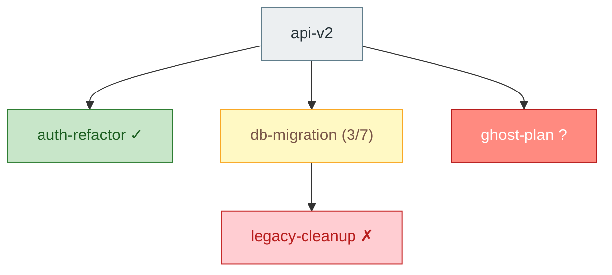

The user wants to build a dependency graph across plans. Follow these steps:

### Step 1: Collect all plans

Scan these directories for `.md` files:

- `.claude/plans/` — active plans
- `.claude/completed/` — completed plans
- `.claude/cancelled/` — cancelled plans

Exclude these meta files (they are indexes, not plans):
`COMPLETED.md`, `CANCELLED.md`, `DEPENDENCIES.md`

Each plan has a canonical name: the filename without `.md`.

### Step 2: Parse each plan

For every plan file, extract two things:

**1. Dependencies** — from YAML frontmatter:

```yaml
---
depends_on: [auth-refactor, db-migration]
---
```

`depends_on` may be a YAML list or a single string. If there's no frontmatter or no `depends_on` key, the plan has no dependencies. Dependency values are plan names (filename without `.md`).

**2. Completion status** — based on location and checkbox state:

- In `.claude/completed/` → **complete**
- In `.claude/cancelled/` → **cancelled**
- In `.claude/plans/`:
  - Count `- [x]` (checked) and `- [ ]` (unchecked) boxes. Be case-insensitive on the `x`.
  - Zero boxes total → **not started** (no checklist means nothing's been started)
  - All checked → **complete** (ready to archive — note this in the output)
  - Some checked → **partial** with ratio `N/M`
  - None checked → **not started**

A dependency referenced by `depends_on` that doesn't match any file → **missing**.

### Step 3: Build the graph

Write `.claude/plans/DEPENDENCIES.md` with this structure:

````markdown
# Plan Dependencies

_Generated by `/dependencies` on <YYYY-MM-DD>._

## Graph



## Status

| Plan | Status | Depends on |
|---|---|---|
| api-v2 | not started | auth-refactor, db-migration, ghost-plan |
| auth-refactor | complete | — |
| db-migration | partial (3/7) | legacy-cleanup |
| legacy-cleanup | cancelled | — |

## Issues

- **Missing:** `api-v2` depends on `ghost-plan`, which doesn't exist in plans/, completed/, or cancelled/.
- **Ready to archive:** none
- **Blocked on cancelled:** `db-migration` depends on `legacy-cleanup` (cancelled).
````

Notes on the output:

- Node labels: use the plan name plus a status hint — `✓` for complete, `(N/M)` for partial, nothing for not started, `✗` for cancelled, `?` for missing.
- Quote node labels that contain spaces, parens, or slashes: `name["label (3/7)"]`.
- Sort the status table alphabetically by plan name.
- Include an `## Issues` section only if there's something to report. Flag:
  - **Missing** dependencies (referenced but no file exists)
  - **Ready to archive** (active plans where every checkbox is checked)
  - **Blocked on cancelled** (a plan depending on a cancelled plan — likely a problem)
  - **Cycles** in the graph (if detected). If there's a cycle, still emit the graph but list the cycle members under Issues.
- If there are zero plans, write a minimal `DEPENDENCIES.md` that says "No plans found." — don't emit an empty Mermaid block.
- If no plan has any `depends_on`, the graph will have nodes but no edges. That's fine — still emit it.

### Step 4: Confirm

Tell the user:

"Wrote dependency graph to `.claude/plans/DEPENDENCIES.md`. N plans scanned, M dependencies, K issues flagged."

If issues were flagged, surface the most important ones (missing deps, cycles, blocked-on-cancelled) directly in the response so the user sees them without opening the file.
